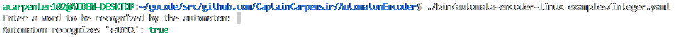

# AutomatonEncoder
A program which takes an input file and encodes an automaton for testing of a Finite State Machine

---

## Automaton Package
This struct holds information of a 5-Tuple: $(Q, Σ, δ, q_0, F)$ of a [DFA](https://en.wikipedia.org/wiki/Deterministic_finite_automaton) through three variables:
```golang
// Automaton is a 3-Tuple representing a deterministic finite automaton.
type Automaton struct {
	StartState         int
	AcceptStates       []int
	TransitionFunction map[rune][]int
}
```
 - $Q$: The set of states, is implied by the length of the slice `[]int` which maps an input for each state to an output state.
 - $Σ$: The alphabet, is implied by the `rune` which maps inputs to the output state.
 - $δ$: The transition function, is specified by the `TransitionFunction` directly. $δ : Q \times Σ \rightarrow Q, \ \ \forall\  q \in Q, \ \ \forall\  l \in Σ$ that is to say, that for every state, $δ$ maps each letter of the alphabet to a new state.
 - $q_0$: The start state of the automaton, is specified by the integer `StartState`. In this implementation, $q_0 \in [1, n]$, where $n$ is the number of states.
 - $F$: The set of accept states, is specified by the integer slice `AcceptStates`. $q \in [1, n],\ \  \forall\  q \in F$ these specify the final states in which a word composed of input symbols from $Σ$ are accepted in.

The `Automaton` struct implements a method `Recognize(word string) bool`. This method returns `true` if the given word is recognized by the language the automaton specifies.

---

## YAML
To represent an automaton in a more human readable form, this package supplies a function `EncodeAutomaton(inStream []byte) (*Automaton, error)` to encode a finite deterministic automaton into Go based on byte stream input from a `.yaml` file.

```yaml
# Yaml file for a 4-tuple description of a finite automaton (alphabet is infered from the transition function)

# Deterministic Finite Automaton which encodes the regular expression (-|+)?[0-9]+
states: 4
initial: 1
finalstates: [3]
transitions:
  - input: "-+"
    outputs: [2,4,4,4]
  - input: "0123456789"
    outputs: [3,3,3,4]
```

<a id="states" href="#states" class="field">`states`</a> <span class="type">Integer</span> 
- Defines the number of states $n$ in the automaton. $Q : [1, n]$

<a id="initial" href="#initial" class="field">`initial`</a> <span class="type">Integer</span> 
- Defines the initial state $q_0$ of the automaton.

<a id="finalstates" href="#finalstates" class="field">`finalstates`</a> <span class="type">List of Integer</span> 
- Defines the set of states $F$ which the automaton accepts.

<a id="transitions" href="#transitions" class="field">`transitions`</a> <span class="type">List of Map</span> 
- The list of transitions which defines the transition function $δ$.

<span class="parent-field">transitions.</span><a id="transitions-transition" href="#transitions-transition" class="field">`transition`</a> <span class="type">Map</span> 
- A transition which maps all input symbols in $Σ$ to the set of all states $Q$.

<span class="parent-field">transition.</span><a id="transition-input" href="#transition-input" class="field">`input`</a> <span class="type">String</span> 
- The input string maps all symbols in the string to the set of outputs.

<span class="parent-field">transition.</span><a id="transition-outputs" href="#transition-outputs" class="field">`outputs`</a> <span class="type">List of Integer</span> 
- The set of output states in $Q$ where the input state is defined by the index of the list.

---

## Using the provided API
The binary file generated by this program is a very basic User Interface which allows a user to input an automaton and test words which the automaton may recognize.

The path of a `.yaml` file specifying an automaton must be passed as an argument to the binary file. The program will then validate that that `.yaml` file correctly specifies an automaton, and proceed to query the user for words and outputting whether or not the automaton recognizes that word.

### Usage


### Validation

